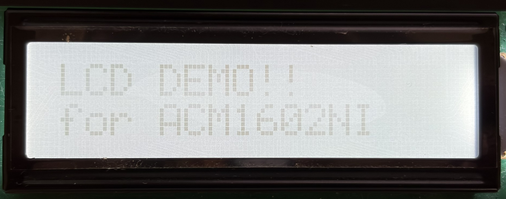

# LCDドライバー for ACM1602NI-FLW-FBW-M01

## 目次
1. [概要](#概要)
2. [ディレクトリ構成](#ディレクトリ構成)
3. [API](#API)
4. [使用例](#使用例)
5. [備考](#備考)

## 概要
LCDデバイス「ACM1602NI-FLW-FBW-M01」に対応するデバイスドライバについて記載する。  

本ドライバは「ACM1602NI-FLW-FBW-M01」の制御機能を抽象化し文字列の表示に特化したモジュールとして提供する。  
なお、マイコン-LCDデバイス間の通信IFについては本モジュールの責務外としている。  


## ディレクトリ構成
本モジュールのディレクトリ構成を以下に示す。  

```text
lcd-driver-acm1602ni/
  ├── docs/
  │  └─images
  ├── example/
  |     ├── Core/
  |     ├── Drivers/
  |     └── lcd_demo.h
  |          ├── lcd_demo.c
  |          └── lcd_demo.h
  ├── inc/
  |     └── acm1602ni.h
  └── src/
        └── acm1602ni.c
```


## API
公開API一覧を表に記載する。 

| API                          | brief                                       |
| :--------------------------- |---------------------------------------------|
| acm1602ni_init               | ACM1602NI初期化                              |
| acm1602ni_write_string_at    | 指定した行列位置を起点に文字列の書き込みを行う。 |
| acm1602ni_write_string       | 現在の行列位置から文字列の書き込みを行う。      |
| acm1602ni_move_ddram_address | DDRAM ADDRESS位置移動                        |
| acm1602ni_command            | コマンド設定                                 |


## 使用例
以下の文字列を表示するコード例を示す。  
なお、本モジュールでは送信IF機能(I2C処理)はサポートしないため、環境に応じて利用者が定義すること。  



```c
/**
 * @brief デバイスドライバinclude
 */
#include "../../inc/acm1602ni.h"

/**
 * @brief デバイスドライバ内で定義しているコールバックの型
 */
static int lcd_send_cb(uint8_t address, uint8_t *pData, uint32_t length, uint32_t wait);

void main(void)
{
    /* ACM1602NI-FLW-FBW-M01の初期化・送信コールバックの設定 */
    acm1602ni_init(lcd_send_cb);

    /* 1/2行目に表示する文字列を設定 */
    acm1602ni_write_string_at("LCD DEMO!!",    0, 0);
    acm1602ni_write_string_at("for ACM1602NI", 1, 0);

    while(1)
    {
        ;
    }
}


/**
 * @brief 送信コールバック
 * @param address スレーブアドレス
 * @param pData   送信データを示すメモリ領域
 * @param length  送信データの長さ
 * @param wait    送信完了後の待ち
 */
static int lcd_send_cb(uint8_t address, uint8_t *pData, uint32_t length, uint32_t wait)
{
    /* 環境に応じた処理の定義 ここから */

    /* 環境に応じた処理の定義 ここまで */

    return 0;
}
```

## 備考
表示バッファ管理機能(内部バッファの追加、バッファ管理・文字列編集・表示更新実行等...)を追加予定...  

<!-- 
フェーズ2設計・実装案
```text
void acm1602ni_buffer_set_text(const char *txet, uint16_t line);
void acm1602ni_buffer_insert_text(const char *txet, uint16_t line, uint16_t position);
void acm1602ni_buffer_write()
```
-->